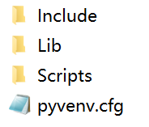

# Vscode环境搭建手册

通过按本手册一步步操作，您可以得到一个空的、可运行的在vscode环境下的python项目开发环境。

这个环境包括的内容有：

- Python虚拟环境
- 一个推荐的文件目录，包括业务代码、单元测试代码环境

大致步骤

1. 安装Python环境
2. 配置vscode的Python运行环境
3. 在vscode中执行单元测试

## 0. 环境背景

- 操作系统：windows 10
- Python环境：Anaconda3，python 3.8.8
- Vscode：1.63.0
- 项目名称：my_app (必须用户自己修改)

### 0.1 目录结构

项目目录结构借鉴Maven默认Java项目结构，如下：


其中：

- src目录存放全部python源代码和配置文件
  - main目录存放业务代码，test目录存放单元测试代码
  - xxx\python存放python源代码
  - xxx\resources存放配置文件
- docs存放项目文档
- .vscode目录存放Vscode的配置文件

## 1. 配置Python环境

需要逐项完成：

1. 建立虚拟环境；
2. 导入依赖库

### 1.1 虚拟环境建立

进入虚拟环境待安装目录，在命令行中依次执行以下操作：

```shell
# 新建虚拟环境，my_app替换成自己的项目名：
python -m venv my_app --system-site-packages
```

执行后看到安装目录下出现新的文件夹，文件夹结构如下，即成功。



进入 Lib\site-packages 目录，新建一个".pth"文件，其内容为项目的源代码路径，要确保main在上方，test在下方。

“.pth”内容如下，具体路径要根据实际情况修改：

```txt
C:\\workspace\\my_app\\src\\main\\python\\
C:\\workspace\\my_app\\src\\test\\python\\
```

### 1.2 导入依赖库

项目需要导入所依赖的全部库，一般会有一个requirements.txt文件。

步骤一：先在命令行进入虚拟环境，操作如下：

```shell
# 进入my_venv\Scripts目录，执行 activate.bat 命令，启动虚拟环境；
cd venv\my_app\Scripts
activate
# 看到出现(my_app)前缀即成功
```

步骤二：升级pip组件，如下操作：（强烈建议）

```shell
python -m pip install --upgrade pip
```

步骤三：安装依赖库。在国内网速较满，可使用-i -t参数从镜像服务器上下载

```shell
pip install -r requirement.txt -i  http://mirrors.aliyun.com/pypi/simple/ --trusted-host=mirrors.aliyun.com --no-dependencies
# 说明加上--no-dependencies参数，是为了解决依赖冲突问题
```

## 2. 配置vscode

完成Python环境配置后，就要配置vscode环境，使得vscode工具同我们配置的环境进行连接。

打开vscode，先“File->Open folder”打开我们的my_app项目目录。

然后找到 .vscode\\settings.json，找打“"python.pythonPath"项目，填写刚刚新建的虚拟环境对应的路径，如：

```txt
"python.pythonPath": "c:\\Python\\venv\\feedme\\Scripts\\python.exe",
```

然后建议重启vscode。

## 3. 执行单元测试

重新打开vscode，打开“测试”侧边栏目，刷新后应看到有一个test_app的用例。

点击箭头执行，变绿执行成功说明配置全部完成。

恭喜，开始写代码吧！！！

## 附件

### 附件1 当下包依赖的导出

包依赖的导出

```shell
pip list --format=freeze > requirements.txt
# 包关系导出到 requirements.txt 文件
```
